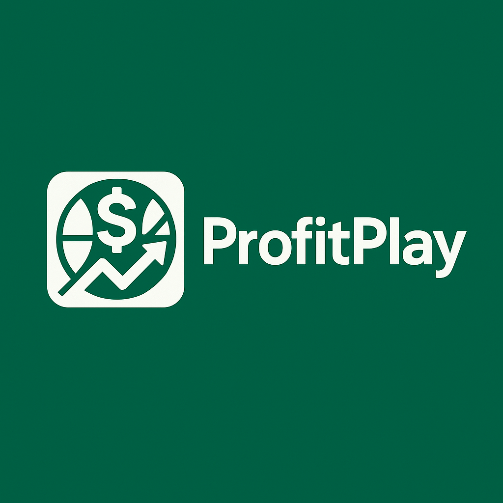

# COMM4190 (Spring 2005) Final Project; ProfitPlay 

## Project Group E

### An NBA Betting Advisor by Kian Ambrose and Ethan Roytman
----

This project is a customized ChatGPT-powered sports betting bot built specifically for NBA basketball betting, modeled after DraftKings-style wagers (e.g., spreads, moneylines, and player props). Our goal is to combine structured prompting, real-time betting data, and personalized user interaction to deliver a smart, adaptive betting experience.

## Purpose

Most GPT betting bots offer generic advice with little structure or personalization. Our approach goes further by:

- Integrating live betting lines via [The Odds API](https://the-odds-api.com/), which pulls data from multiple sportsbooks (including but not limited to DraftKings).
- Using web search (via Tavily) to retrieve up-to-date injury reports, trends, and team performance within the last 24 hours.
- Labeling bets by category — "lock," "risk," or "parlay" — based on expected value and current line movement.
- Adapting all suggestions to the user’s experience level and stated bankroll.
- Maintaining persistent chat memory (via usernames), so users can return to prior sessions and continue where they left off.

## Features

- **Custom prompting framework** built for U.S. sports betting workflows  
- **Live odds API integration** for accurate, real-time betting lines  
- **Web search for injury reports and trends** limited to the past 24 hours  
- **Session continuity** using persistent storage per username  
- **Smart welcome-back messages** referencing past bets  
- **Gradio front-end UI** with a polished blue theme

## Research & Evaluation

We’re also using this assistant to:

- Benchmark against existing GPT-based betting bots 
- Measure how structured prompts, real-time info, and personalization affect accuracy, user engagement, and profitability 
- Explore whether memory + prompting strategies lead to better betting decisions over time

## Why It’s Different

Compared to other sports betting bots:

- Ours is structured, not just a generic Q&A engine  
- It uses live odds from multiple sportsbooks (not static lines)  
- It adapts based on your experience level, bankroll, and goals  
- It remembers you — past sessions are saved and resumed

## How to Use

1. Enter a username to start or resume your betting session  
2. Answer a few onboarding questions about your experience and goals  
3. Get personalized NBA betting picks with probabilities and explanations  
4. Return later — the assistant remembers your history and adapts accordingly

